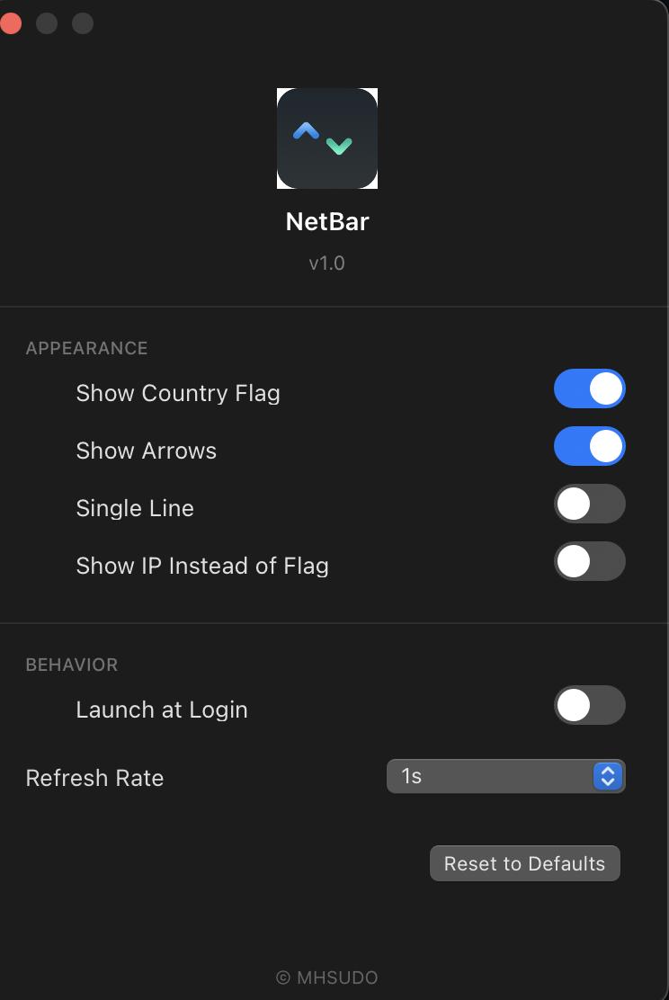

<p align="center">
  
</p>

<h1 align="center">NetBar</h1>

<p align="center">
  <strong>Real-time network speeds. One glance. Zero bloat.</strong><br>
  A native macOS menu bar app that shows upload/download speeds and your IP's country flag — so you always know what's happening with your connection.
</p>

<p align="center">
  <a href="https://github.com/mh-sudo/NetBar/releases"></a>
  <a href="https://opensource.org/licenses/MIT"></a>
  <a href="https://swift.org"></a>
  <a href="https://apple.com/macos"></a>
</p>

---

<p align="center">
  <a href="#why-netbar">Why NetBar?</a> · 
  <a href="#screenshots">Screenshots</a> · 
  <a href="#features">Features</a> · 
  <a href="#install"><b>Install</b></a> · 
  <a href="#netbar-vs-networker-pro">vs NetWorker Pro</a> · 
  <a href="#under-the-hood">Under the Hood</a> · 
  <a href="#faq">FAQ</a> · 
  <a href="#license">License</a>
</p>

---

## Why NetBar?

Activity Monitor can show network throughput, but you have to open a full window and click to the Network tab. NetBar puts it in the menu bar where you actually look.

<p align="center">
  
</p>

Upload a file? Watch the speed climb. Download stalling? See it flatline in real time. VPN connected to the wrong region? The country flag tells you instantly.

---

## Screenshots

<p align="center">
  
</p>
<p align="center">
  
</p>

---

## Features

| Feature | What it does |
|:---|:---|
| **Live speed display** | Upload and download speeds update every second, right in your menu bar |
| **Country flag** | See which country your IP resolves to — instant VPN verification |
| **Instant VPN detection** | Flag updates in under a second when you switch servers |
| **Triple-layer network monitoring** | `SCDynamicStore` + `NWPathMonitor` + interface polling — catches VPN transitions others miss |
| **Customizable layout** | Single-line, dual-line, upload-only, download-only — your choice |
| **Launch at Login** | Set it once, forget it's there (until you need it) |
| **364 KB** | 10x smaller than NetWorker Pro. Pure Swift, native AppKit, zero dependencies |

---

## Install

### Homebrew (one-liner)

```bash
brew install --cask https://raw.githubusercontent.com/mh-sudo/NetBar/main/Casks/netbar.rb
```

### Manual

Download the latest `.zip` from [Releases](https://github.com/mh-sudo/NetBar/releases) and drag `NetBar.app` into `/Applications`.

> [!IMPORTANT]
> macOS will block the app on first launch (ad-hoc signed, no Developer ID). Fix it once:
> ```bash
> xattr -cr /Applications/NetBar.app
> ```

---

## Who it's for

**Developers** — Is `npm install` downloading or hanging? Is the deploy actually sending data? NetBar answers that without opening a terminal.

**VPN users** — Switch servers and instantly see if traffic is routing correctly. NetBar's triple-layer detection catches VPN transitions in under a second. No more "wait, am I actually in Tokyo?"

**Remote workers** — On sketchy hotel Wi-Fi? Watch the speed before joining a video call. If it's flat at 0 B/s, maybe use your phone's hotspot.

**Metered connections** — Tethering from your phone? See exactly how much data is moving, in real time.

**Older Macs** — Runs on macOS 13 Ventura+. NetWorker Pro requires macOS 15.6+ (Tahoe), leaving many Macs behind.

---

## NetBar vs NetWorker Pro

| | NetBar | NetWorker Pro |
|:---|:---|:---|
| **Price** | **Free**, open source | $2.99 |
| **App size** | **364 KB** | 3.3 MB |
| **macOS required** | **13.0+** (Ventura) | 15.6+ (Tahoe) |
| **Menu bar speeds** | Yes | Yes |
| **Country flag** | Yes (built-in) | Yes (added v10.1.1) |
| **VPN detection** | **Triple-layer, instant** | No |
| **Open source** | Yes | No |
| **Process monitor** | No | Yes |
| **Network connections** | No | Yes |
| **Info panel** | No | Yes |

Both show network speeds in the menu bar. **NetBar's edge**: free, 10x smaller, works on older macOS, and has instant VPN flag detection built in from day one.

**NetWorker Pro's edge**: process monitoring, open connections list, and an info panel. But it requires macOS 15.6+ and costs $2.99.

---

## Under the hood

- **Speed measurement** — Polls `getifaddrs()` system counters every second. Calculates byte deltas across `en*` (Wi-Fi), `utun*` (VPN), and `pdp_ip*` (cellular) interfaces. No packet sniffing.
- **IP geolocation** — Races 5 providers concurrently (ip-api.com, ipapi.co, country.is, ipinfo.io, ipwho.is). First response wins. Ephemeral session, zero caching.
- **Network change detection** — Three layers: `SCDynamicStore` Darwin notifications, `NWPathMonitor`, and interface polling. 0.5s debounce. Catches VPN transitions that single-layer detection misses.
- **Privacy** — The only network request is the IP lookup. No telemetry, no analytics, no tracking.

---

## Troubleshooting

**Speeds stuck at 0 B/s?**
Make sure you have active network traffic — open a website or start a download. NetBar shows *total* interface throughput, so background apps count too.

**"App is damaged" warning?**
Run `xattr -cr /Applications/NetBar.app` — the app is ad-hoc signed, not notarized.

**Wrong country flag?**
Click "Refresh IP" in the dropdown. If you just switched VPN servers, give it a second — the flag updates automatically on network change.

---

## Roadmap

- [ ] Lock monitor to specific network interface (track VPN traffic separately)
- [ ] Data cap alerts (daily limit + notification)
- [ ] Speed history popup graph

PRs welcome.

---

## FAQ

<details>
<summary><strong>Does it work on Intel Macs?</strong></summary>
Yes. macOS 13+, Intel or Apple Silicon.
</details>

<details>
<summary><strong>Does it support Wi-Fi 6E / Wi-Fi 7?</strong></summary>
It reads from macOS network counters — works with whatever hardware your Mac has.
</details>

<details>
<summary><strong>Is there a subscription?</strong></summary>
No. Free, open source, no ads, no in-app purchases.
</details>

<details>
<summary><strong>How is this different from NetWorker Pro?</strong></summary>
Both show network speeds in the menu bar. NetBar is free, 10x smaller (364 KB vs 3.3 MB), runs on older macOS (13.0+ vs 15.6+), and has instant VPN flag detection built in. NetWorker Pro has additional features like process monitoring, open connections, and an info panel — but costs $2.99 and requires macOS Tahoe.
</details>

---

## License

[MIT](https://opensource.org/licenses/MIT) — use it, fork it, ship it.
