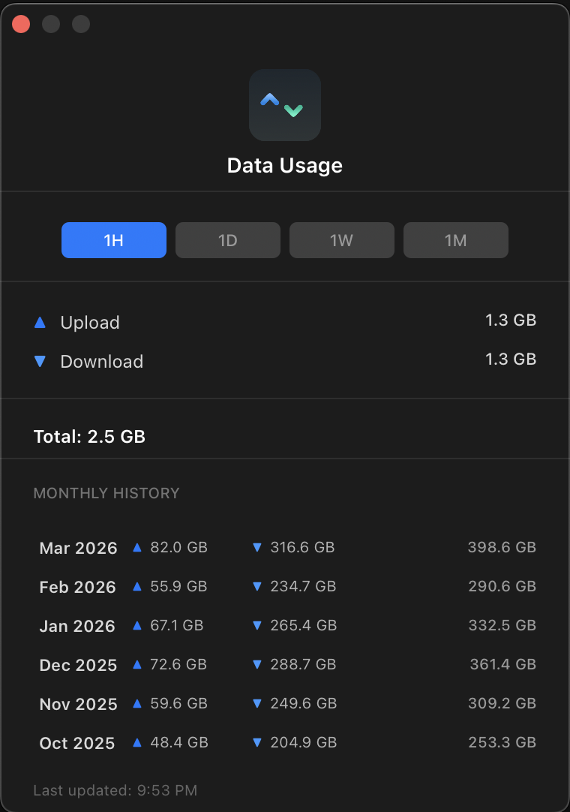

<div align="center">


# NetBar

### A free, open-source network speed monitor for your macOS menu bar

**Real-time upload and download speeds · VPN country flag detection · Data usage tracking · Interface lock · Zero dependencies**

[](https://github.com/mh-sudo/NetBar/releases)
[](https://opensource.org/licenses/MIT)
[](https://swift.org)
[](https://apple.com/macos)

**[Install](#install) · [Screenshots](#screenshots) · [Features](#features) · [Why NetBar?](#why-netbar) · [FAQ](#faq)**

</div>

---

## What is NetBar?

NetBar is a lightweight macOS menu bar app that shows your real-time internet speed and the country flag of your current IP address. It also tracks your data usage across hours, days, weeks, and months with built-in monthly history.

---

## Why NetBar?

Activity Monitor can show network throughput, but it takes a full window and a click into the Network tab. NetBar puts your speed directly in the menu bar, always visible:

- Uploading a file? Watch the number climb in real time.
- Download stalled? See it flatline instantly.
- Just connected to a VPN? The country flag updates in under a second so you know if you're routing through the right region.
- Tracking VPN data separately? Lock monitoring to your `utun` interface so only tunnel traffic counts.
- On sketchy hotel or airport Wi-Fi? Check throughput before joining a call.

<p align="center">
  
</p>

---

## Features

| Feature | Description |
|---|---|
| Live speed display | Upload and download speed refreshes every second, right in the menu bar |
| Country flag detection | See which country your IP resolves to for an instant VPN sanity check |
| Data usage tracking | See how much data you've used in the last hour, day, week, or month. 12-month history with monthly breakdown |
| Interface lock | Lock monitoring to a single network interface (e.g. your VPN tunnel) to track specific traffic separately |
| Triple-layer VPN detection | Combines `SCDynamicStore`, `NWPathMonitor`, and interface polling to catch VPN/network transitions other menu bar apps miss |
| Customizable layout | Single-line, dual-line, upload-only, or download-only display |
| Launch at login | Set it once and forget it's there |
| 100% open source | MIT licensed. Read the code, fork it, audit it yourself |
| No telemetry | The only network requests NetBar makes are the IP lookup for the flag. No analytics, no tracking, no accounts |

---

## Screenshots

<p align="center">
  
</p>

<p align="center">Live speed display in the menu bar with country flag</p>

<p align="center">
  
</p>

<p align="center">Data usage dashboard: 1H, 1D, 1W, 1M views with 12-month history</p>

<p align="center">
  
</p>

<p align="center">Settings panel: toggle country flag, arrows, single-line mode, launch at login, refresh rate, and interface lock</p>

---

## Install

### Homebrew (recommended)

Copy the whole block, paste into Terminal, hit enter:

```bash
brew tap mh-sudo/netbar https://github.com/mh-sudo/NetBar && \
brew trust mh-sudo/netbar && \
brew install --cask netbar
```

Homebrew 6.0+ requires third-party taps to be explicitly trusted before running their code. This is a supply-chain security feature, normal for any non-official tap.

### Manual install

1. Download the latest `.zip` from [Releases](https://github.com/mh-sudo/NetBar/releases)
2. Drag `NetBar.app` into `/Applications`
3. Since NetBar is ad-hoc signed (not notarized, no Apple Developer Program fee for a free open-source tool), macOS Gatekeeper will block it on first launch. Fix it once:

   ```bash
   xattr -cr /Applications/NetBar.app
   ```

---

## Who it's for

- Developers: Is `npm install` actually downloading, or did it hang? Is your deploy sending data? Check without opening a terminal.
- VPN users: Switch servers and confirm you're routed correctly in under a second. Lock monitoring to a VPN interface to track only tunnel traffic — great for metered or capped VPN services.
- Remote workers: Check real throughput before joining a video call on unfamiliar Wi-Fi.
- Anyone on a metered connection: Tethering from your phone? Watch exactly how much data is moving.
- Older Macs: Runs on macOS 13 (Ventura) and up, including Intel Macs. No need for the latest hardware.

---

## NetBar vs. paid alternatives

| | NetBar | Typical paid menu bar monitor |
|---|---|---|
| Price | Free, open source | $2.99+ |
| App size | Under 500 KB | 2–4 MB |
| macOS required | 13.0+ (Ventura) | Often latest only |
| Live menu bar speed | Yes | Yes |
| Country flag / VPN check | Yes, built in | Sometimes, as add-on |
| Data usage tracking | Yes, 1H/1D/1W/1M + 12-month history | Rarely, if ever |
| Instant VPN transition detection | Yes, triple layer | Usually single layer or none |
| Open source and auditable | Yes | No |
| Telemetry-free | Yes | Varies |

---

## Under the hood

Speed measurement polls `getifaddrs()` system counters every second and calculates byte deltas across `en*` (Wi-Fi), `utun*` (VPN), and `pdp_ip*` (cellular) interfaces. Use **interface lock** in Settings to filter tracking to a single interface. No packet sniffing, no elevated permissions.

IP geolocation races five providers concurrently (ip-api.com, ipapi.co, country.is, ipinfo.io, ipwho.is); first response wins. Ephemeral lookups, zero caching, zero accounts.

Network change detection uses three independent layers (`SCDynamicStore` Darwin notifications, `NWPathMonitor`, and interface polling with 0.5s debounce) to reliably catch VPN transitions that single-layer detection often misses.

Data usage is tracked by sampling the same system counters every 3 minutes and storing cumulative snapshots on disk. The dashboard computes deltas on the fly for any time window and keeps a rolling 12-month archive.

The only outbound request NetBar ever makes is the IP lookup for the flag. No analytics SDKs, no crash reporters phoning home, no accounts.

---

## Troubleshooting

**Speeds stuck at 0 B/s?**
Make sure there's active traffic. Open a site or start a download. NetBar shows total interface throughput, so background apps count too.

**"App is damaged" warning on first launch?**
Run `xattr -cr /Applications/NetBar.app`. This happens because the app is ad-hoc signed rather than notarized through Apple's paid Developer Program.

**Wrong country flag showing?**
Click "Refresh IP" in the dropdown. If you just switched VPN servers, give it a second. It updates automatically on network change.

---

## Roadmap

- [x] Lock monitoring to a specific network interface (track VPN traffic separately)
- [x] Data usage tracking — hour, day, week, and month views with 12-month history
- [ ] Data cap alerts (usage threshold + notification)
- [ ] Wi-Fi SSID display in menu bar

Have an idea? [Open an issue](https://github.com/mh-sudo/NetBar/issues) or send a PR. Contributions welcome.

---

## FAQ

**Does NetBar work on Intel Macs?**
Yes, macOS 13.0+, Intel or Apple Silicon.

**Is there a subscription or in-app purchase?**
No. Free and open source, forever. No ads, no tracking.

**Does it work with any VPN?**
Yes. NetBar detects network/VPN interface changes at the system level, so it works with any VPN client.

**How is NetBar different from Activity Monitor?**
Activity Monitor requires opening a full app window and navigating to the Network tab. NetBar lives permanently in your menu bar with live numbers, plus it adds VPN country-flag verification that Activity Monitor doesn't offer.

**Is my data safe?**
The only network request NetBar makes is an IP geolocation lookup to show the country flag. No telemetry, no analytics, no accounts. See [Under the hood](#under-the-hood).

---

## License

[MIT](LICENSE). Use it, fork it, ship it.

<div align="center">

If NetBar saves you a click, give it a star. It helps other people find it.

</div>
